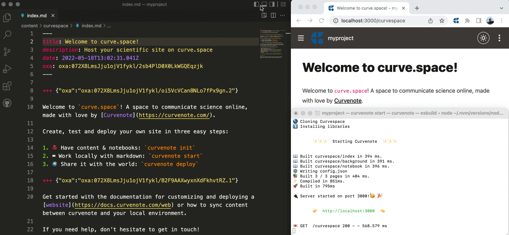

# `curvenote`

[](https://www.npmjs.com/package/curvenote)
[](https://github.com/curvenote/curvenotejs/blob/main/LICENSE)


Create, edit, share and publish scientific documents.

## Overview

`curvenote` is an open source library and command line interface (CLI) to create share and publish technical documents.

- Write papers and reports in Markdown and Jupyter ([docs](https://docs.curvenote.com/cli))
- Create and share interactive websites ([docs](https://docs.curvenote.com/web))
- Export to Word, LaTeX, and PDF with any [template](https://github.com/curvenote/templates) ([docs](https://docs.curvenote.com/export))

In addition to being completely local, `curvenote` can optionally sync content to <https://curvenote.com> to allow you to work with collaborators who enjoy WYSIWYG editing, commenting & real time collaboration for technical documents.

## Get Started

Curvenote is available through Node and NPM. Unless you already have this on your system you will have to [install NodeJS](https://docs.curvenote.com/cli/installing-prerequisites). See [full install instructions](https://docs.curvenote.com/cli/installing) in the docs!

```bash
npm install -g curvenote
curvenote init
curvenote start
curvenote deploy
```

[](https://docs.curvenote.com/web)

## Built with Curvenote

Curvenote allows you to easily create, edit, and publish content to the web as a fast, optimized site with interactive citations, cross-referencing, math, and dynamic figures from Jupyter Notebooks.

Curvenote can be used to create all sorts of open-access content, click the links below to see some examples!

- [Courses](https://geosci-inversion.curve.space/inversion) & [books](https://climasoma.curve.space/)
- [Seminar](https://seminars.simpeg.xyz/) & [conference](https://transform.softwareunderground.org/) websites
- [Blogs](https://curvenote.com/blog) & [technical websites](https://www.stevejpurves.com/blog)
- [Papers](https://www.stevejpurves.com/la-palma-earthquakes) & [reports](https://www.stevejpurves.com/computational-finance)
- [Documentation](http://curvenote.com/docs)
- [Sharing Jupyter Notebooks](https://jarmitage.curve.space/)

### Interactive and Linked

The default website you create can have interactive Jupyter Notebook features, and live-preview of cross-references and citations.

[PhD Thesis](https://phd.row1.ca/) with linked references, equations, and export to PDF.
[](https://phd.row1.ca/)

[Interactive Papers](https://www.stevejpurves.com/la-palma-earthquakes/interactive-timelines-altair) with Jupyter Notebooks and interactive visualizations.
[](https://www.stevejpurves.com/la-palma-earthquakes/interactive-timelines-altair)

These interactive scientific sites can be easily deployed on a hosting service called [curve.space](https://curve.space) or can also be hosted on your own custom domain.

## Work locally with Live Reload

The client library is entirely local, and rebuilds in ~50ms for most projects. Meaning you can preview your content as you are writing!

[](https://www.stevejpurves.com/la-palma-earthquakes/interactive-timelines-altair)

## Direct export from Curvenote

First login, see [authorization docs](https://docs.curvenote.com/cli/authorization) to get an API token.

```bash
curvenote token set
> YOUR_API_TOKEN
```

Then you can directly export your curvenote documents to:

- Microsoft Word (.docx)
- Markdown (.md) - using MyST
- LaTeX (.tex)
- PDF (.pdf)

```bash
curvenote export docx https://curvenote.com/@curvenote/blog/communicating-science communicating-science.docx
curvenote export md https://curvenote.com/@curvenote/blog/version-control-for-scientists version-control.md
curvenote export tex https://curvenote.com/@curvenote/blog/version-control-for-scientists version-control.tex -template plain_latex
curvenote export pdf https://curvenote.com/@curvenote/blog/version-control-for-scientists version-control.pdf -template arxiv_nips
```

## LaTeX and PDF Dependencies

Exporting to:

- LaTeX (`latex`|`tex`) with a template option specified
- or to PDF

Requires the [jtex](https://pypi.org/project/jtex/) python package to be installed and available on the user's `PATH`.

With python 3.7 or greater installed, install `jtex` via pip:

```bash
python -m pip install jtex
```
